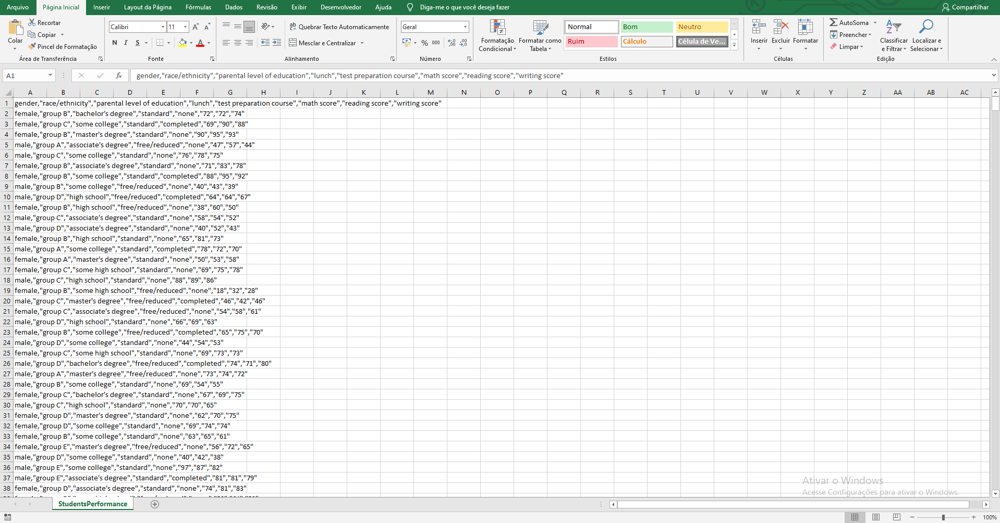
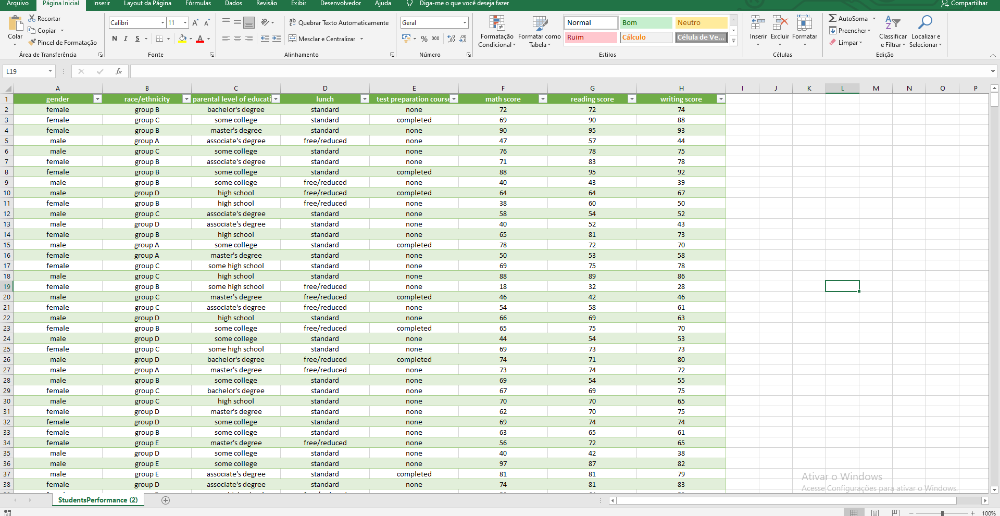
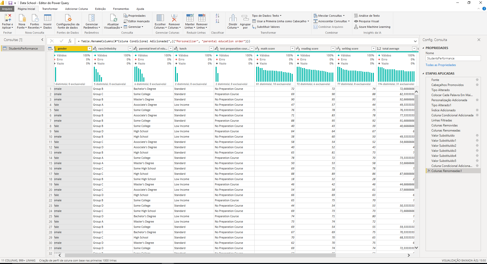

Neste projeto baixei um dataset do kaggle https://www.kaggle.com/spscientist/students-performance-in-exams com a performance de alunos de uma escola fictícia

Após abrir a tabela no excel para ver com que tipo de dados eu estava lidando eu aproveitei e dei uma organizada 

Depois de organizar os dados eu abri o arquivo no PowerBi e fiz o tratamento de alguns dados e a criação de algumas colunas pertinentes

