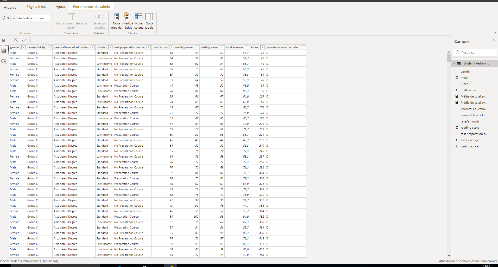
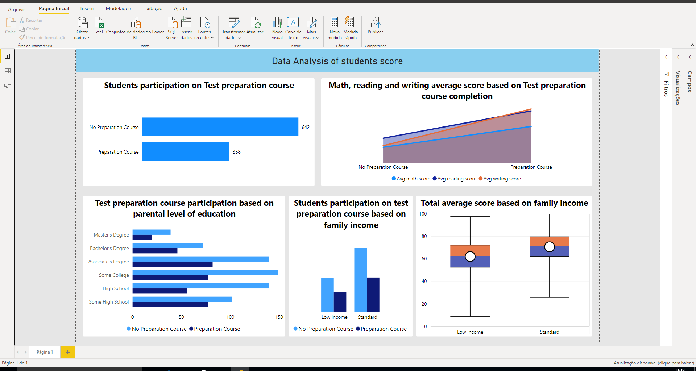
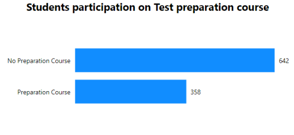

Neste projeto baixei um dataset do kaggle https://www.kaggle.com/spscientist/students-performance-in-exams com a performance de alunos de uma escola fictícia

Após abrir a tabela no excel para ver com que tipo de dados eu estava lidando eu aproveitei e dei uma organizada 

Depois de organizar os dados eu abri o arquivo no PowerBi e fiz o tratamento de alguns dados e a criação de algumas colunas pertinentes

Com os dados já tratados eu montei um dashboard querendo levantar uma análise sobre as notas dos alunos dessa escola, com base nos resultados encontrados eu pude 
chegar a algumas concluõses:

No gráfico "Students participation on Test preparation course" eu pude perceber que o número de alunos que não participavam do curso preparatório para as provas que a 
escola oferecia era quase o dobro do número de alunos que participavam. 

