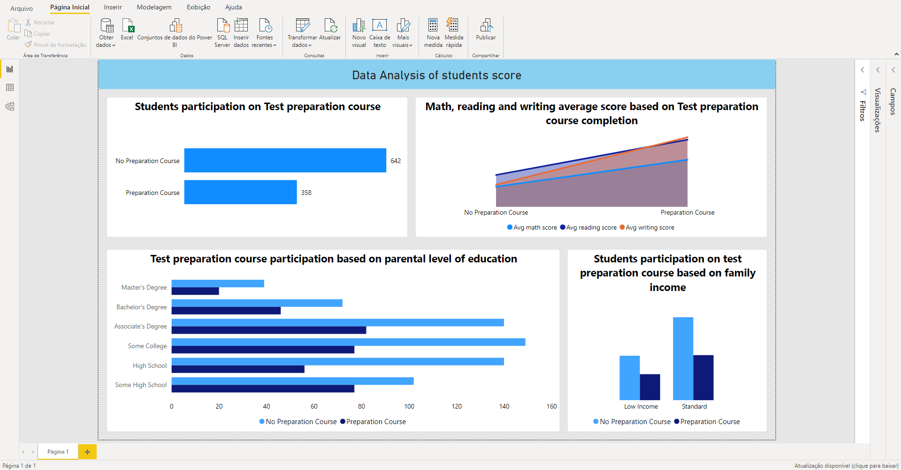

Neste projeto baixei um dataset do kaggle https://www.kaggle.com/spscientist/students-performance-in-exams com a performance de alunos de uma escola fictícia

Após abrir a tabela no excel para ver com que tipo de dados eu estava lidando eu aproveitei e dei uma organizada 

Depois de organizar os dados eu abri o arquivo no PowerBi e fiz o tratamento de alguns dados e a criação de algumas colunas pertinentes

Com os dados já tratados eu montei um dashboard querendo levantar uma análise sobre as notas dos alunos dessa escola, com base nos resultados encontrados eu pude 
chegar a algumas concluõses:

No gráfico "Students participation on Test preparation course" eu pude perceber que o número de alunos que não participavam do curso preparatório para as provas que a 
escola oferecia era quase o dobro do número de alunos que participavam. 

Com isso em mente fiz o gráfico "Math, reading and writing average score based on Test preparation course completion" para descobrir se o fato dos alunos não participarem
do curso preparatório teria influência direta em suas notas e percebi que havia sim uma relação, mostrando que em média os estudantes que participavam do curso preparatório tinham uma nota maior em todas as três matérias.

Fiz o gráfico "Test preparation course participation based on parental level of education" para saber se teria alguma relação entre o nível de escolaridade dos pais de cada
aluno e a participação dele no curso preparatório, e por mais que alguns níveis da escolaridade dos pais apresentassem maior ou menor participação dos alunos, não achei
tão pertinente montar uma estratégia ao redor disso

Em "Students participation on test preparation course based on family income" pude perceber que não existia uma relação tão grande entre renda familiar e participação dos alunos, porém me fez questionar se a renda familiar poderia influenciar nas notas

O último gráfico, chamado de "Total average score based on family income" mostrou que alunos com uma baixa renda familiar não só apresentavam uma média total(soma das notas das
três matérias/número de matérias) menor, além de variações muito maiores nas notas, quando comparados com alunos de renda familiar média ou maior

Com base no estudo dos dados apresentados a ideia mais interessante seria aumentar 

